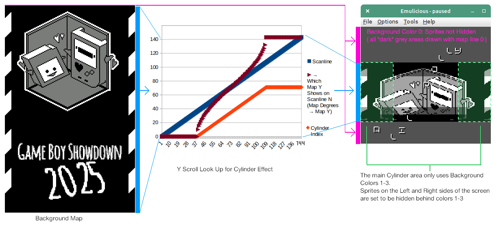

## Rolly Scrolly Demo

Hastily made little GB Demo for Game Boy Showdown 2025 with a Cylinder like effect and some wraparound sprite text.

ROM downloadable on itch.io:
https://bbbbbr.itch.io/rolly-scrolly-demo

### Effect

For the Cylinder:
- Per scanline Y scroll adjustments from a pre-computed table (made in a spreadsheet) that create the cylinder distortion
- There is a matching set of per scanline GB palette adjustments which darken the colors toward the top and bottom of the cylinder

For the bounce:
- There's a per-frame sine wave table that adjusts where the cylinder is located (by setting an initial Y scroll offset which the cylinder code factors in)

For the Text:
- The entire cylinder only uses Background (BG) colors 1-3, and the area outside of it is all scrolled to a single line which only uses BG color 0. This is important for the next part
- For hiding the text that goes "behind" the cylinder the sprites on the left 1/4 and right 1/4 of the screen have their BG priority set so that they only show up over BG color 0 (above and below cylinder area) and are hidden by anything with BG color 1-3 (inside cylinder area)
- Then there is a second sine wave table which is used for the text Y position, this is just indexed based on the sprite X position

### Building
Built with GBDK-2020 4.4.0

